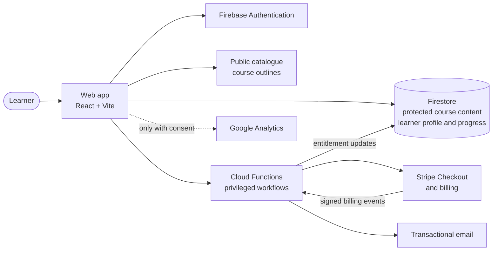
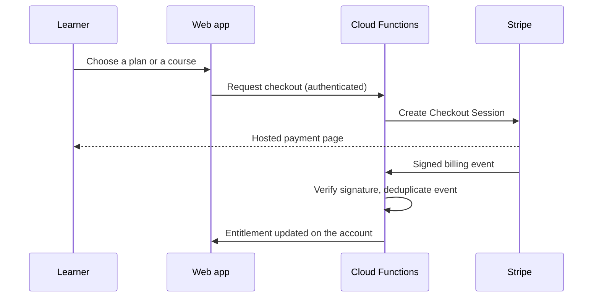

# Platform overview

**Product:** Module — [bymodule.com](https://bymodule.com)
**Last updated:** 30 September 2026
**Scope:** how the platform is organised, at product-architecture level. Production source code, security rules, internal identifiers, endpoints and paid course content are intentionally not published.

Each capability below is labelled with the same status vocabulary used across this repository:

| Label | Meaning |
| --- | --- |
| **Shipped** | Implemented and live in production. |
| **In progress** | Built or being built, not yet live. |
| **Observed** | Supported by real usage or qualitative evidence. |
| **Hypothesis** | Something I intend to test; no effect is claimed. |

---

## 1. System at a glance

Module is a bilingual (French / English) learning platform for professionals who build digital products. It is a single-page React application backed by Firebase and Stripe.

The diagram shows responsibilities, not a deployment topology or an authorization specification.

**Shipped stack:** React 19, Vite, Tailwind CSS 4 with shadcn/ui components, Firebase Authentication, Firestore (hosted in the EU, Paris region), Firebase Cloud Functions, Stripe, a transactional email provider, Cloudflare Pages for the public domain, Vitest and Playwright for automated tests.

---

## 2. Principle: access is a business rule, not a visual state

The most important architectural decision is that **a paywall in the interface is not a protection**. If paid material is shipped to the browser, hiding it behind a button does not protect it.

The platform therefore separates two kinds of data:

| | Public course data | Protected course content |
| --- | --- | --- |
| **Examples** | Title, description, level, duration, outline of modules and lessons, learning objectives | Lesson material, exercises, prompts, workshops |
| **Where it lives** | Delivered with the web app, loaded on demand | Stored server-side, read only after sign-in |
| **Who can read it** | Anyone | Only accounts entitled to that course |

Entitlements are evaluated server-side from the learner's account state:

- active free trial;
- active subscription;
- individual course purchase;
- operational roles (administration, translation).

Client-side checks exist only to shape the interface. The same decision is enforced where the data is stored, and a release check scans the public bundle to confirm that no protected lesson text has leaked into it. **(Shipped)**

---

## 3. Course discovery and learning

- **Catalogue and course pages.** Learners can browse the catalogue, filter it and read a course's full outline, objectives and expected deliverable before opening any lesson. **(Shipped)**
- **Course player.** Lessons are delivered step by step, with progress saved on the learner's account, a module menu, keyboard navigation and a light/dark theme. Content is loaded in the learner's language. If a course is not available in that language, the player says so explicitly instead of silently showing the other language. **(Shipped)**
- **Dashboard.** It offers resume-where-you-left-off, my courses, progress and time spent, certificates, resources and settings. **(Shipped)**
- **Self-check questions.** Lessons include quizzes with explanatory feedback. Answers stay in the learner's browser session. They are **not** stored as a learner knowledge model and are **not** an AI assessment. **(Shipped)**
- **Certificates** are issued on course completion. They attest that a course was followed, not that mastery was assessed. **(Shipped)**
- **First-sign-in onboarding.** A five-question onboarding (role, goal, level, interests, weekly time) recommends the most relevant course and a realistic pace. **(In progress)**

---

## 4. Content as structured data

Courses are written as structured source files, not as page layouts. A content compiler validates them against a content standard and produces separate outputs for separate jobs:

| Output | Used by | Contains |
| --- | --- | --- |
| Public outline | Catalogue, course pages, search | Metadata, outline, objectives |
| Reader content | Course player (protected) | Lesson material, exercises, self-check questions |
| Knowledge layer | Server-side only, reserved for future use | Typed facts, concepts, recommendations, assessments |

The content standard defines lesson structure, learning outcomes, prerequisites, misconceptions, sources with verification dates, and assessments. Automated linting enforces it. The quiz checks, for example, reject answer patterns that give the correct option away. **(Shipped)**

The catalogue currently holds 31 courses, each written in French and English. The compiler guarantees structural consistency. It does not guarantee pedagogical quality, which is reviewed separately. **(Shipped)**

The knowledge layer is the foundation for later retrieval work. **It does not mean a retrieval system or a Learning Copilot is deployed.** See §8.

---

## 5. Billing and entitlements

- Checkout sessions are created server-side, for authenticated users only, and are rate-limited. **(Shipped)**
- Billing events are verified, deduplicated and applied server-side. The browser never grants itself access. **(Shipped)**
- Three commercial models share one entitlement model: free trial, monthly subscription and per-course purchase. That lets the business test pricing without changing the course experience. **(Shipped)**

---

## 6. Languages

French and English are first-class, not a translation layer added at the end. **(Shipped)**

- The language is part of the URL (`/fr/…`, `/en/…`). URL paths themselves are translated, and it changes only when the learner chooses it.
- All interface text goes through one translation system. Automated tests fail the build if a key is missing in one language or if untranslated text is hard-coded in a component.
- An end-to-end suite browses the whole product in both languages and flags any text in the wrong language.
- Course content is authored in both languages with enforced structural parity.

---

## 7. Privacy and measurement

- **Consent first.** Analytics and marketing measurement are split and load only after consent. Learners can reopen their cookie choices at any time. **(Shipped)** Removing free text typed by the learner, such as search queries, from event payloads is part of the privacy work below. **(In progress)**
- **Data location.** Learner data in Firestore is stored in the EU. Some processors (authentication, payments, email, analytics) operate from the US under the EU-US Data Privacy Framework. **(Shipped)**
- **Self-service data rights.** Two features are being built:
  - download of all personal data as a readable archive plus a machine-readable file;
  - account deletion with a grace period, cancellation of the subscription, deletion at each processor, and legally required retention only.

  **(In progress)**
- **Measurement maturity.** Events are instrumented across acquisition, sign-up, learning and checkout. Instrumented events are not the same thing as a validated funnel: activation has not yet been defined from evidence. **(Shipped / Observed)**

---

## 8. What this architecture is preparing

The next product question comes from usage, not technology: completed learning so far has happened in guided, instructor-led contexts. Autonomous, self-paced learning is not yet demonstrated. **(Observed)**

The working model to address it is **FIND → LEARN → CHECK → REMEMBER**: help learners choose what to learn, assist them in context, check understanding against explicit objectives, and keep evidence of what they have learned. **(Hypothesis)**

The architecture supports that direction without claiming it:

- **FIND** starts with the onboarding recommendation. **(In progress)**
- **LEARN** and **CHECK** depend on the structured content and knowledge layer. **(Shipped foundation)**
- A contextual **Learning Copilot** and persisted learner knowledge are **not built**. **(Hypothesis)**

---

## 9. Quality and operations

- Unit, security-rule and end-to-end browser tests are run before each release. They cover access control, both languages and the main learner journeys. Visual and accessibility audits are run on major interface changes. **(Shipped)**
- The public site deploys automatically when a change is merged. Backend and database-rule changes are deployed separately, after review. **(Shipped)**

---

## What this document does not contain

It contains no production source code, security rules, internal identifiers, endpoint or infrastructure configuration, user records, credentials or paid lesson content. It describes the architecture as designed and shipped; it is neither a security audit nor a certification.
